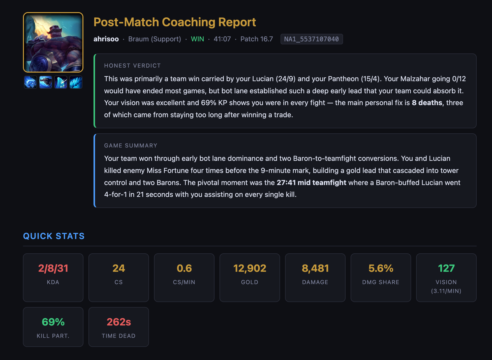

# lol-match-analysis

[](https://www.awesomescreenshot.com/video/51360222?key=e6d8dd45551a7f17d2cc092a93c839e0)

[](https://www.awesomescreenshot.com/video/51360222?key=e6d8dd45551a7f17d2cc092a93c839e0)
[](https://jinayoon.github.io/lol-match-analysis/sample-braum.html)

A Claude Code skill that gives you an instant private coaching report for your last League of Legends match.

Designed for people who know they should review their matches to get better but are too lazy. It assumes you're never going to watch your replays and just tells you concrete things you should work on, with enough context to jog your memory on what happened and why.

I find it most helpful to generate and read the analysis right after a game while having my op.gg or in-client match details page open.

## What it does

- Analyzes your last match using your Riot ID and a Riot API key you provide
- Pulls live item and champion data from the official League of Legends wiki and Data Dragon — no stale patch info
- Breaks down all 4 game phases: draft, early, mid, and late game
- Covers decision audits, resource efficiency, objective priority, teamfight breakdowns, and win condition adherence
- Identifies the 3 swing moments that actually decided the game
- Gives 3 prioritized things to work on — grounded in specific timestamps from *this* game, not generic advice
- Saves the full report as a Markdown file

## Quick start (no coding required)

### Mac

**1. Install Claude Code**
Open Terminal (search "Terminal" in Spotlight) and paste:
```bash
curl -fsSL https://claude.ai/install.sh | bash
```

**2. Connect your account**
Type `claude` and hit enter. It'll open a browser to log in — follow the prompts, then come back to Terminal. Once you're in, type `/exit` to close the session.

**3. Install the skill**
Back in Terminal, paste:
```bash
mkdir -p ~/.claude/skills/lol-match-analysis && curl -o ~/.claude/skills/lol-match-analysis/SKILL.md "https://raw.githubusercontent.com/jinayoon/lol-match-analysis/main/skills/lol-match-analysis/SKILL.md"
```

**4. Get a Riot API key**
Go to [developer.riotgames.com](https://developer.riotgames.com), log in with your League account, and copy the key on your dashboard. Free, takes 30 seconds. *(Keys expire every 24h — grab a fresh one each session.)*

**5. Run it**
Type `claude` to start a session, then type `/lol-match-analysis` and hit enter. It'll ask for your API key and Riot ID (`Name#TAG`), then analyze your last game automatically.

---

### Windows

**1. Install Git for Windows**
Download and install it from [git-scm.com](https://git-scm.com/downloads/win). Required for Claude Code to work on Windows.

**2. Install Claude Code**
Open PowerShell (search "PowerShell" in the Start menu) and paste:
```powershell
irm https://claude.ai/install.ps1 | iex
```

**3. Connect your account**
Type `claude` and hit enter. It'll open a browser to log in — follow the prompts, then come back to PowerShell. Once you're in, type `/exit` to close the session.

**4. Install the skill**
Back in PowerShell, paste:
```powershell
New-Item -ItemType Directory -Force -Path "$env:USERPROFILE\.claude\skills\lol-match-analysis"; Invoke-WebRequest -Uri "https://raw.githubusercontent.com/jinayoon/lol-match-analysis/main/skills/lol-match-analysis/SKILL.md" -OutFile "$env:USERPROFILE\.claude\skills\lol-match-analysis\SKILL.md"
```

**5. Get a Riot API key**
Go to [developer.riotgames.com](https://developer.riotgames.com), log in with your League account, and copy the key on your dashboard. Free, takes 30 seconds. *(Keys expire every 24h — grab a fresh one each session.)*

**6. Run it**
Type `claude` to start a session, then type `/lol-match-analysis` and hit enter. It'll ask for your API key and Riot ID (`Name#TAG`), then analyze your last game automatically.

---

## For developers

```bash
# Mac/Linux
curl -fsSL https://claude.ai/install.sh | bash
mkdir -p ~/.claude/skills/lol-match-analysis
curl -o ~/.claude/skills/lol-match-analysis/SKILL.md \
  "https://raw.githubusercontent.com/jinayoon/lol-match-analysis/main/skills/lol-match-analysis/SKILL.md"
```

## Contributing

Contributions welcome! If you want to extend the analysis, add support for other regions, or improve the coaching framework, feel free to open a PR.

## Requirements

- Claude Code — install via Terminal/PowerShell (see above), no Node.js needed
- A Riot Games developer API key (free)
- Mac: Terminal (built in)
- Windows: PowerShell + [Git for Windows](https://git-scm.com/downloads/win)

---

lol-match-analysis isn't endorsed by Riot Games and doesn't reflect the views or opinions of Riot Games or anyone officially involved in producing or managing Riot Games properties. Riot Games and all associated properties are trademarks or registered trademarks of Riot Games, Inc.
